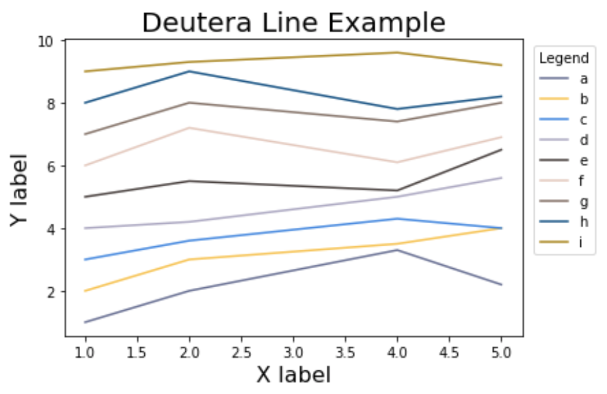
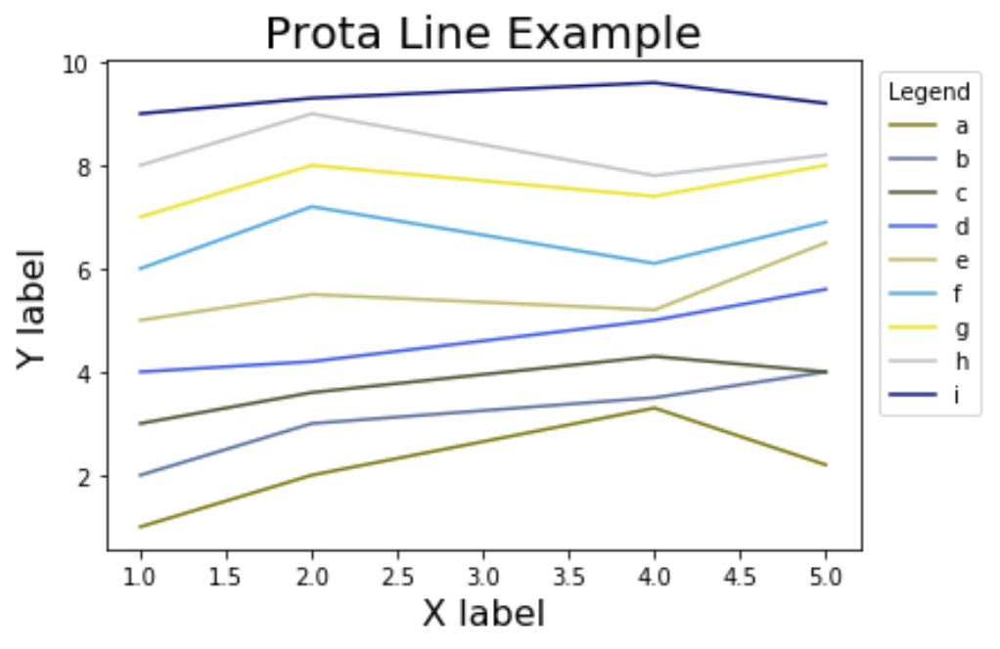
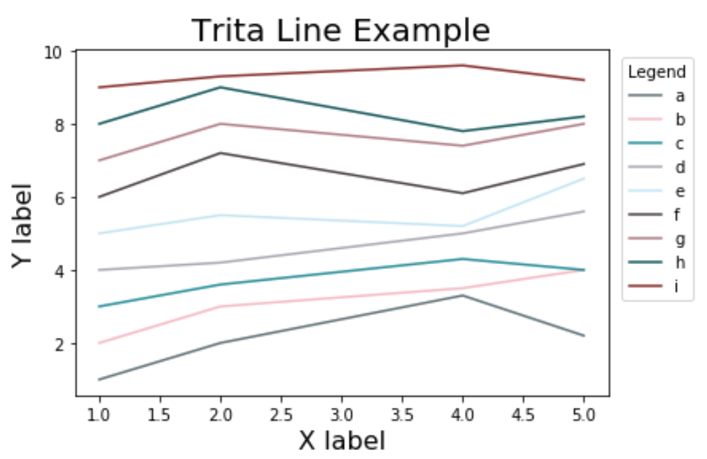
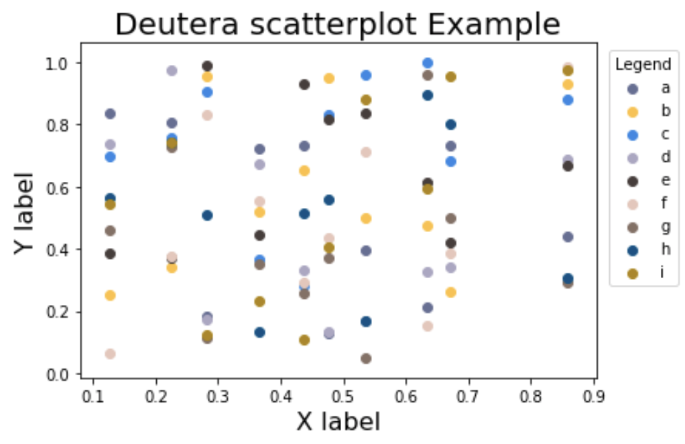
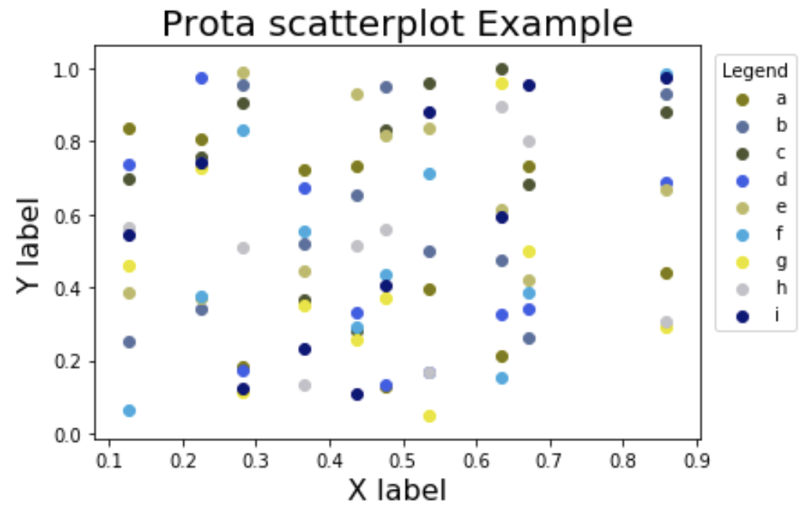
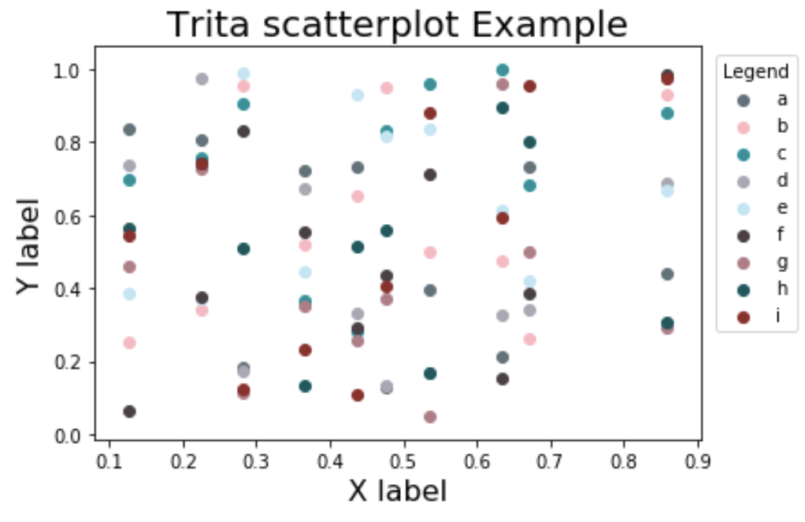

# Colourblind8

A python package that creates colourblind friendly plots.

### Authors

| [Ian Flores](https://github.com/ian-flores) | [Sabrina Tse](https://github.com/sabrinatkk) | [Hayley Boyce](https://github.com/hfboyce)
|:------------:|:--------------:|:--------------:|

### Project

**Overview**

`Colourblind8` will be a brand new plotting package implemented for `matplotlib` to optimize graphs into a format interpretable by people with colourblindness. Colourblindness, also known as colour vision deficiency, is a condition that affects individuals how they perceive colours visually. According to [colourblindawareness.org](http://www.colourblindawareness.org/colour-blindness/), colourblindness affects 1 in every 12 men and 1 in every 200 women globally. This package is inspired by the fact that people without knowledge about this condition don't know how to make their graphs accesible. Our objective is to enhance data visualization by implementing proper colours so that the graphs are perceived correctly by all readers as intended.

**Scope**

At this stage, `Colourblind8` will focus on developing settings for the three most prevalent colourblind perspectives - protanopia, deuteranopes and tritanopes (see Appendix for more information on the types of colourblindness). 


### Function Discription

- `plot_lines()`:

  - This function implements a method that makes line graphs accesible to people with one of these three colourblind variants; deuteranopia, protanopia or tritanopia. It modifies the colour of each line, the title, transparency of the objects, legend and axes size as well as the face colour.

   **inputs:** x variable,  y variable (a list of lists), transparency, labels of each y variable, palette colour, title, x labels, y labels and legend title.    
   **output:** a matplotlib object  


- `plot_scatter()`:

  - This function implements a method that makes scatterplots accesible to people with one of these three colourblind variants; deuteranopia, protanopia or tritanopia. It modifies the colour of each line, the title, legend and axes size, transparancy of the objects, as well as the face colour.

   **inputs:** x variable,  y variable (a list of lists), transparency, labels of each y variable, palette colour, title, x labels, y labels and legend title.    
   **output:** a matplotlib object.  


.- `plot_histogram()`:

   - This functions implements a method that makes histograms accesible to people with one of these three colourblind variants; deuteranopia, protanopia or tritanopia. It modifies the colour of each line, the title, legend and axes size, transparancy of the objects number of bins,  as well as the face colour.
   
   **inputs:** y variable (a list of lists), transparency, labels of each y variable, palette colour, title, x labels, y labels and legend title.   
   **output:** a matplotlib object.


for more details please use the the following commands:

`help(Colourblind8)` for class docstring

`help(Colourblind8.modulename)` for module docstring
  

### Installation 


To install `Colourblind8` via pip, please input the following into the Terminal:

```pip install git+https://github.com/UBC-MDS/Colourblind8.git```


### Usage 

Please note, for a more clear execution of our package, Varada Kolhatkar (Lab instructor) suggested an additional document (jupyter notebook) using our package with a test dataset, along with our tests being passed. She found this a more beneficial method of visually comparing the output with the test cases. 
This example can be found in the `Example` folder of this repository named [`Sample_usage.ipynb`](INSERT LINK HERE). 

To use our package it is necessary for all functions to import our package as well as matplotlib in the following manner. 
```
import matplotlib.pyplot as plt
from colourblind8.colourblind8 import Colourblind8
```


#### `plot_lines(self, x, y, alpha = 1.0, labels = None, palette = None, title = None, x_lab = None, y_lab = None, legend_title = None)` : 

The test dataset used for this example is the following

```
x=[1,2,3,4]
y_list=[[1,2,3,4],[3,5,7,9],[4,7,5,9],[1,4,6,8],[4,6,7,9],[1,3,4,8],[0,4,7,2],[-1,4,7,-7],[9,7,5,3]]
```

**Input**

For the *deuteranopia* friendly colour palette, it is necessary to use the following commands for a line graph:

```
cb = Colourblind8()
cb.plot_line(x=x, y=y_list,alpha =1.0, labels =['a','b','c','d','e','f','g','h','i'], palette = 'deutera', title = "Example Line", x_lab = "X" , y_lab = "Y" , legend_title = "Labels" )
```

For the *protanopia* friendly colour palette it is necessary to use the following commands for a line graph:
```

cb = Colourblind8()
cb.plot_line(x=x, y=y_list,alpha =1.0, labels =['a','b','c','d','e','f','g','h','i'], palette = 'prota', title = "Example Line", x_lab = "X" , y_lab = "Y" , legend_title = "Labels" )
```

For the *tritanopia* friendly colour palette it is necessary to use the following commands for a line graph:
```
cb = Colourblind8()
cb.plot_line(x=x, y=y_list,alpha =1.0, labels =['a','b','c','d','e','f','g','h','i'], palette = 'trita', title = "Example Line", x_lab = "X" , y_lab = "Y" , legend_title = "Labels" )
```

**Output**

Deutra                    |  Prota                    | Trita                    |        
:------------------------:|:-------------------------:|:------------------------:|
  |    |   |


#### `plot_scatter(self, x, y, alpha = 1.0, labels = None, palette = None, title = None, x_lab = None, y_lab = None, legend_title = None)`:

The test dataset used for this example is the following

```
x=[1,2,3,4]
y_list=[[1,2,3,4],[3,5,7,9],[4,7,5,9],[1,4,6,8],[4,6,7,9],[1,3,4,8],[0,4,7,2],[-1,4,7,-7],[9,7,5,3]]

```

**Input**

For the *deuteranopia* friendly colour palette, it is necessary to use the following commands for a scatterplot:

```
cb = Colourblind8()
cb.plot_scatter(x=x, y=y_list,alpha =0.8, labels =['a','b','c','d','e','f','g','h','i'], palette = 'deutera', title = "Example Line", x_lab = "X" , y_lab = "Y" , legend_title = "Labels" )
```


For the *protanopia* friendly colour palette it is necessary to use the following commands for a scatterplot:
```

cb = Colourblind8()
cb.plot_scatter(x=x, y=y_list,alpha =1.0, labels =['a','b','c','d','e','f','g','h','i'], palette = 'prota', title = "Example Line", x_lab = "X" , y_lab = "Y" , legend_title = "Labels" )
```

For the *tritanopia* friendly colour palette it is necessary to use the following commands for a scatterplot:
```
cb = Colourblind8()
cb.plot_scatter(x=x, y=y_list,alpha =1.0, labels =['a','b','c','d','e','f','g','h','i'], palette = 'trita', title = "Example Line", x_lab = "X" , y_lab = "Y" , legend_title = "Labels" )
```

**Output**

Deutra                       |  Prota                      | Trita                       |        
:---------------------------:|:---------------------------:|:---------------------------:|
  |   |   |


#### `plot_histogram(self, y, alpha = 1.0, bins= None,  labels = None, palette = None, title = None, x_lab = None, legend_title = None)`:

The test dataset used for this example is the following

```
test = Colourblind8()
N = 100
x = np.random.rand(N)
y = np.random.rand(N)
z = np.random.rand(N)
list_y = [x,y,z]

```

**Input**

For the *deuteranopia* friendly colour palette, it is necessary to use the following commands for a scatterplot:

```
cb = Colourblind8()
cb.plot_histogram(y=y_list,alpha =0.8, labels =['a','b','c','d','e','f','g','h','i'], palette = 'deutera', title = "Example Histogram", x_lab = "X" , legend_title = "Labels" )
```


For the *protanopia* friendly colour palette it is necessary to use the following commands for a scatterplot:
```
cb = Colourblind8()
cb.plot_histogram(x=x, y=y_list,alpha =1.0, labels =['a','b','c','d','e','f','g','h','i'], palette = 'prota', title = "Example Histogram", x_lab = "X" , legend_title = "Labels" )
```

For the *tritanopia* friendly colour palette it is necessary to use the following commands for a scatterplot:
```
cb = Colourblind8()
cb.plot_histogram(x=x, y=y_list,alpha =1.0, labels =['a','b','c','d','e','f','g','h','i'], palette = 'trita', title = "Example Histogram", x_lab = "X" , legend_title = "Labels" )
```

**Output**

Deutra                    |  Prota                    | Trita                   |        
:------------------------:|:-------------------------:|:-----------------------:|
  |   |   |


### Our Package in the Python Ecosystem 

To the best of our knowledge, there is currently no other colourblind specific package available for matplotlib that offers colourblind-friendly palettes or themes. `Seaborn`, in conjunction with `matplotlib`, offers a single default colour palette ([source](https://seaborn.pydata.org/tutorial/color_palettes.html)) named `colorblind` targeting readers with general colourblindness and does not accommodate different variants of colourblind conditions.

`Colourblind8` will bridge the gap as it attempts to fit into the Python ecosystem by offering a convenient and effective way to give all matplotlib visualizations a theme and fully inclusive colour palette.  A package that shows a similar contribution to the python ecosystem is [`daltonize`](https://github.com/joergdietrich/daltonize). This package aids to creating all images colourblind friendly as opposed to `Colourblind8` which will make specifically data visualizations, plots and graphs fully inclusive for all readers.

### Appendix

Protanopia

Protanopes are more likely to confuse:-
1. Black with many shades of red
2. Dark brown with dark green, dark orange and dark red
2. Some blues with some reds, purples and dark pinks
3. Mid-greens with some oranges

Deuteranopes

Deuteranopes are more likely to confuse:-
1. Mid-reds with mid-greens
2. Blue-greens with grey and mid-pinks
3. Bright greens with yellows
4. Pale pinks with light grey
5. Mid-reds with mid-brown
6. Light blues with lilac

Tritanopes

The most common colour confusions for tritanopes are light blues with greys, dark purples with black, mid-greens with blues and oranges with reds. 

source:http://www.colourblindawareness.org/colour-blindness/types-of-colour-blindness/

-------------------------------------------------------
http://www.colourblindawareness.org/colour-blindness/

