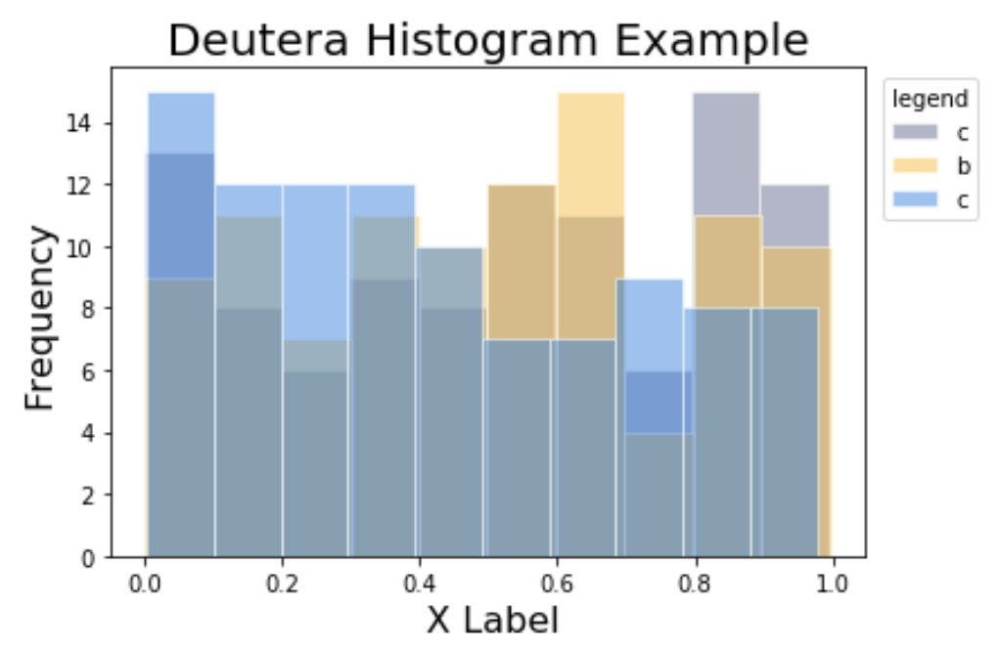
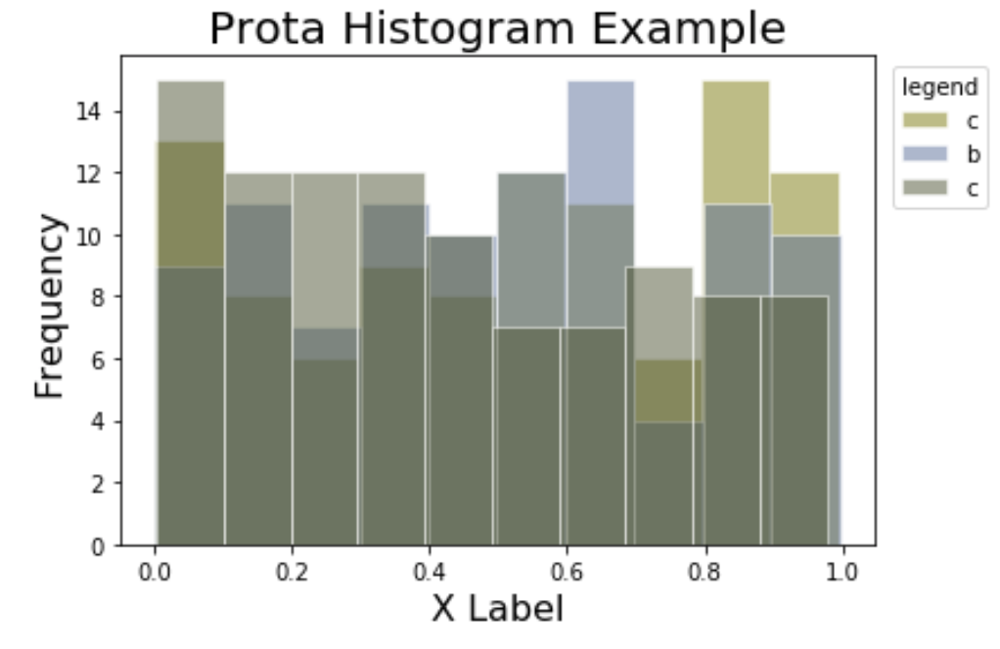
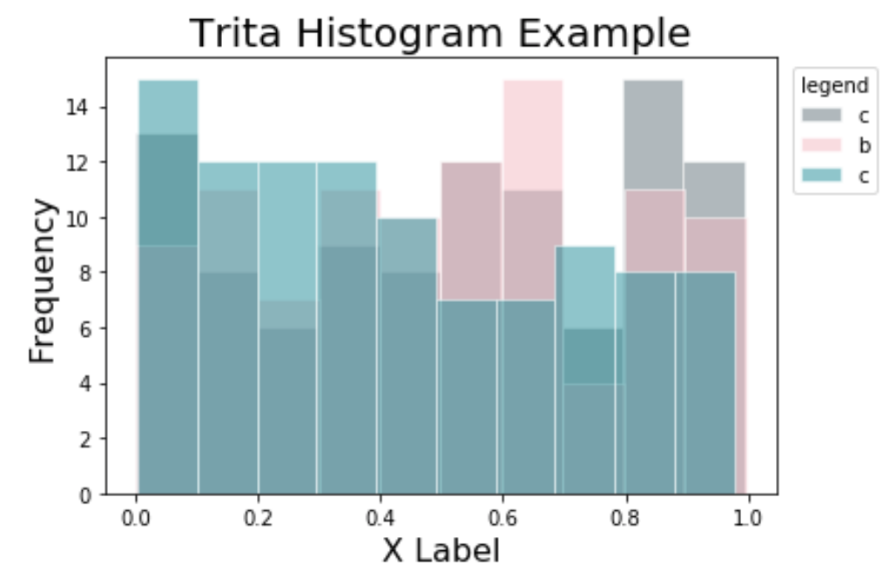
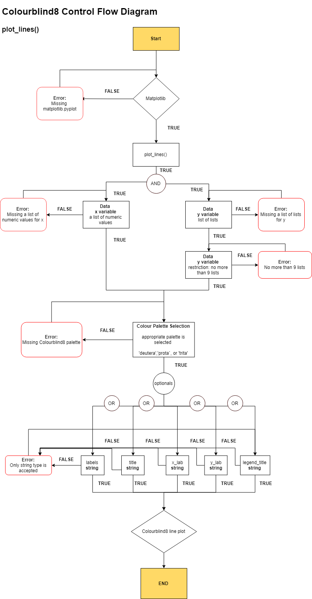
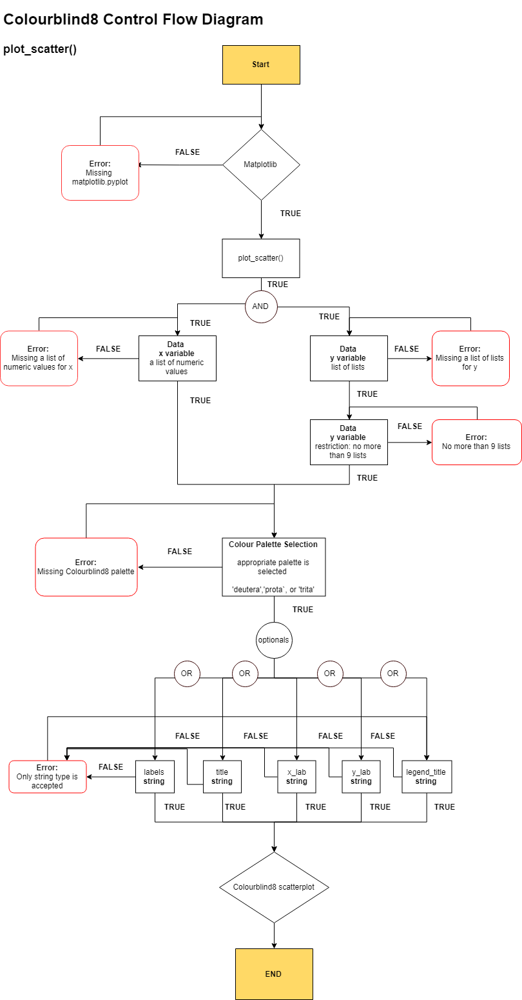
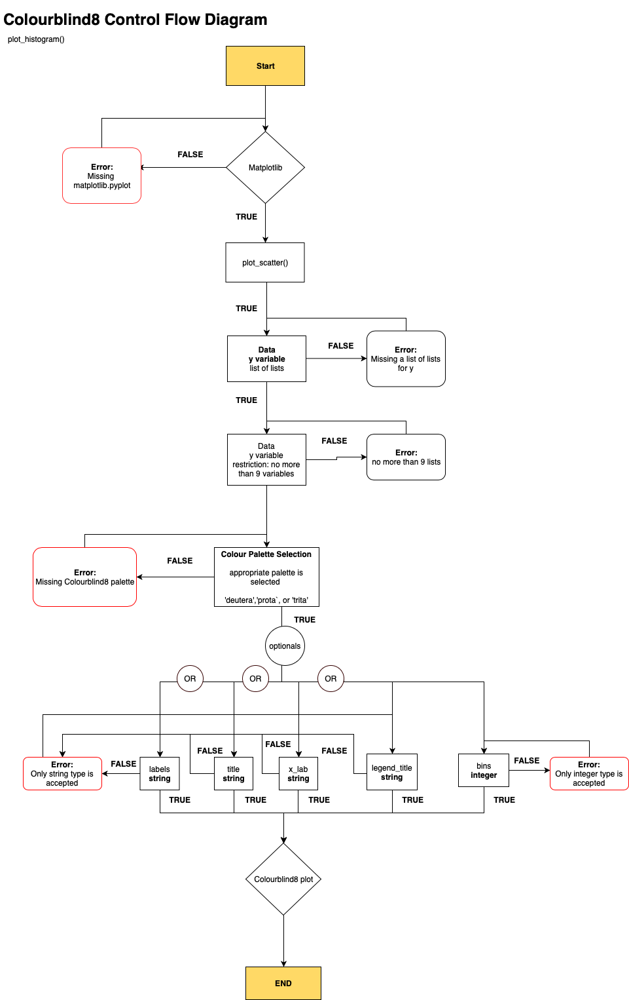

# Colourblind8

A python package that creates colourblind friendly plots.

### Authors

| [Ian Flores](https://github.com/ian-flores) | [Sabrina Tse](https://github.com/sabrinatkk) | [Hayley Boyce](https://github.com/hfboyce)|
|:------------:|:--------------:|:--------------:|

### Project

**Overview**

`Colourblind8` will be a brand new plotting package implemented for `matplotlib` to optimize graphs into a format interpretable by people with colourblindness. Colourblindness, also known as colour vision deficiency, is a condition that affects individuals how they perceive colours visually. According to [colourblindawareness.org](http://www.colourblindawareness.org/colour-blindness/), colourblindness affects 1 in every 12 men and 1 in every 200 women globally. This package is inspired by the fact that people without knowledge about this condition don't know how to make their graphs accessible. Our objective is to enhance data visualization by implementing proper colours so that the graphs are perceived correctly by all readers as intended.

**Scope**

At this stage, `Colourblind8` will focus on developing settings for the three most prevalent colourblind perspectives - protanopia, deuteranopia and tritanopia (see [Appendix](https://github.com/UBC-MDS/Colourblind8#Appendix) for more information on the types of colourblindness).


### Function Description


In this package, three functions are included to make `matplotlib`plots more interpretable for people with protanopia, deuteranopia and tritanopia. Within each function, users can select one of our customized colour palettes via the `palette` argument according to their preference: `deutera` for deuteranopia,`prota` for protanopia ,`trita`for tritanopia. The following are our main functions:

- `plot_lines(x, y, alpha = 1.0, labels = None, palette = None, title = None, x_lab = None, y_lab = None, legend_title = None)`:

  - This function implements a method that creates line graphs by initializing the colour of lines, the face colour of the chart, the transparency of objects, and the font size for title, legend and axes.

   **Inputs:** x variable,  y variable (a list of lists), transparency, labels of each y variable, palette colour, title, x labels, y labels and legend title.    
   **Output:** a matplotlib line graph object.  


- `plot_scatter(x, y, alpha = 1.0, labels = None, palette = None, title = None, x_lab = None, y_lab = None, legend_title = None)`:

  - This function implements a method that creates scatterplots by initializing the colour of data points, the face colour of the chart, the transparency of objects, and the font size for title, legend and axes.

   **Inputs:** x variable,  y variable (a list of lists), transparency, labels of each y variable, palette colour, title, x labels, y labels and legend title.    
   **Output:** a matplotlib scatterplot object.


- `plot_histogram(y, alpha = 1.0, bins = None, labels = None, palette = None ,title = None, x_lab = None, legend_title = None)`:

   - This functions implements a method that enhances histograms through modifying the colour of histogram layers, the face colour of the chart, the transparency of objects,bin size and the font size for title, legend and axes.

   **Inputs:** y variable (a list of lists), transparency, bin size,  labels of each y variable, palette colour, title, x labels, y labels and legend title.   
   **Output:** a matplotlib histogram object.


For more details, please use the following commands:

`help(Colourblind8)` for class docstring

`help(Colourblind8.modulename)` for module docstring


### Installation

To install `Colourblind8` via pip, please input the following into the Terminal:

`pip install git+https://github.com/UBC-MDS/Colourblind8.git`

To upgrade to the latest version, use:

`pip install -- upgrade git+https://github.com/UBC-MDS/Colourblind8.git`

### Usage

Please note, for a more clear execution of our package, Varada Kolhatkar (UBC MDS instructor) suggested an additional document (jupyter notebook) to demonstrate how to use our package with a test dataset, along with our tests being passed. She found this a more beneficial method of visually comparing the output with the test cases.

The demonstration can be found in the `example` folder of this repository named [sample_usage.ipynb](https://github.com/UBC-MDS/Colourblind8/blob/master/example/sample_usage.ipynb).


##### Step by step guide

1. Since `Colourblind8` is built on `matplotlib`, it is necessary to import `matplotlib`, as well as `Colourblind8`. Don't forget to initialize `Colourblind8` before using.

```
import matplotlib.pyplot as plt
from colourblind8.colourblind8 import Colourblind8()
```
2. Select one of the available Colourblind8 graphs and one of our customized colour palettes for data visualization. We picked `plot_lines()` and `palette = "trita"` as an example:

```
cb = Colourblind8()
cb.plot_lines(x, y, alpha = 1.0, labels = None, palette = "trita", title = None, x_lab = None, y_lab = None, legend_title = None)
```

Three colour palettes are available : `deutera`,`prota`,`trita`


### Sample Graphs

#### Line Graph:

#####  Input
data:
```
x=[1,2,3,4]

y_list=[[1,2,3,4],[3,5,7,9],[4,7,5,9],[1,4,6,8],[4,6,7,9],[1,3,4,8],[0,4,7,2],[-1,4,7,-7],[9,7,5,3]]
```
```
cb=Colourblind8()
cb.plot_lines(x, y_list, alpha =1.0, labels =['a','b','c','d','e','f','g','h','i'], palette = 'trita', title = "Trita Line Example", x_lab = "X label",  y_lab = "Y label", legend_title = "Legend")
```
#####  Output (colour palettes' presentation)

deutera                    |  Prota                    | Trita                    |        
:------------------------:|:-------------------------:|:------------------------:|
  |    |   |

#### Scatterplot Graph

##### Input
data:
```
N = 10
x = np.random.rand(N )
y_1 = np.random.rand(N)
y_2 = np.random.rand(N)
y_3 = np.random.rand(N)
y_4 = np.random.rand(N)
y_5 = np.random.rand(N)
y_6 = np.random.rand(N)
y_7 = np.random.rand(N)
y_8 = np.random.rand(N)
y_9 = np.random.rand(N)

y_list= []
for i in range(9):
    y = np.random.rand(N)
    y_list.append(y)
```


```
cb = Colourblind8()
cb.plot_scatter(x, y_list, alpha =1.0, labels =['a','b','c','d','e','f','g','h','i'], palette = 'deutera', title = "Deutera scatterplot Example", x_lab = "X label",  y_lab = "Y label", legend_title = "Legend" )
```

##### Output (colour palettes' presentation)

deutera                       |  Prota                      | Trita                       |        
:---------------------------:|:---------------------------:|:---------------------------:|
  |   |   |


#### Histogram Graph

##### Input
data:
```
N = 100
x = np.random.rand(N)
y = np.random.rand(N)
z = np.random.rand(N)
list_y = [x,y,z]
```

```
cb = Colourblind8()
cb.plot_histogram(y = list_y, palette= 'prota', x_lab=' X Label', title = 'Deutera Histogram Example', alpha = 0.5, bins =10, labels=['c', 'b', "c"], legend_title="legend")
```

###### Output (colour palettes' presentation)


deutera                    |  Prota                    | Trita                   |        
:------------------------:|:-------------------------:|:-----------------------:|
  |   |   |


### Control Flow Diagram

As we are committed to support open source, we provide the complete `Colourblind8` Control Flow Diagram for each function in our package for users who are interested in the backend workflow:






**Branch Coverage Testing**

(waiting for instruction from instructor on whether to use coverage.py or manual testing)


### Our Package in the Python Ecosystem

To the best of our knowledge, there is currently no other colourblind specific package available for matplotlib that offers colourblind-friendly palettes or themes. `Seaborn`, in conjunction with `matplotlib`, offers a single default colour palette ([source](https://seaborn.pydata.org/tutorial/color_palettes.html)) named `colorblind` targeting readers with general colourblindness and does not accommodate different variants of colourblind conditions.

`Colourblind8` will bridge the gap as it attempts to fit into the Python ecosystem by offering a convenient and effective way to give all matplotlib visualizations a theme and fully inclusive colour palette.  A package that shows a similar contribution to the python ecosystem is [`daltonize`](https://github.com/joergdietrich/daltonize). This package aids to creating all images colourblind friendly as opposed to `Colourblind8` which will make specifically data visualizations, plots and graphs fully inclusive for all readers.

### Appendix

Protanopia

Protanopes are more likely to confuse:-
1. Black with many shades of red
2. Dark brown with dark green, dark orange and dark red
2. Some blues with some reds, purples and dark pinks
3. Mid-greens with some oranges

Deuteranopes

Deuteranopes are more likely to confuse:-
1. Mid-reds with mid-greens
2. Blue-greens with grey and mid-pinks
3. Bright greens with yellows
4. Pale pinks with light grey
5. Mid-reds with mid-brown
6. Light blues with lilac

Tritanopes

The most common colour confusions for tritanopes are light blues with greys, dark purples with black, mid-greens with blues and oranges with reds.

source:http://www.colourblindawareness.org/colour-blindness/types-of-colour-blindness/

-------------------------------------------------------
http://www.colourblindawareness.org/colour-blindness/
